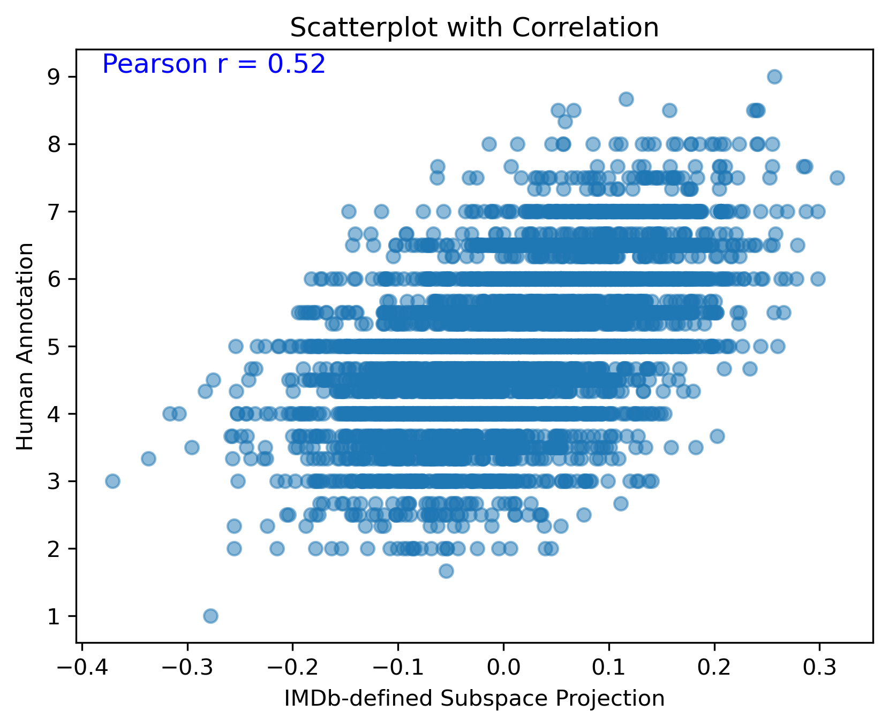
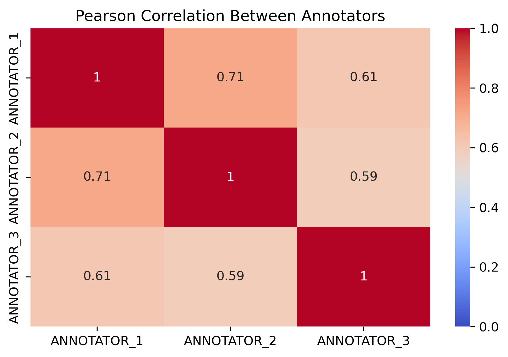

# embedding-projection
A project developing a technique for extracting information from contextual sentence embeddings (sBERT) by utilizing projection of embeddings onto a concept vector (i.e. a Steering Vector in LLM decoder steering literature) 

### The projection of a corpus shows that different classes are seperatable on the concept axis:

Words corresponding to the 10 smallest embeddings:
['worse', 'terrible', 'sucked', 'horrible', 'worst', 'bad', 'rotten', 'unacceptable', 'stupidity', 'awful']
Words corresponding to the 10 largest embeddings:
['pleasure', 'anytime', 'admired', 'admire', 'fabulous', 'classical', 'beloved', 'romantic', 'anthologies', 'lovely']

### To check if the annotation correlates with human annotators:

It seems there is a rather strong correlation between average human anotator and the projection method!

### Lets see get an idea of what an correlation baseline would even look like.
Annotations of semantics vary when on a continous scale. Different computational methods produce different scores, but different humans also correlate differently with eachother.

### Defining the positive- and negative centroids from gold-standard annotations.
As an attempt to improve the correlation to the gold-standard I defined the model by turning gold-standard human ratings into binary positive/negative.
if (rating >= 7), then == positive.
if (rating <= 3) then == negative.
this improved correlation by 0.02:
![./img/Scatterplot_fiction4_w_Person_MiniLM.png]

#### Changing to the larger MPNET-base-v2 model the correlation further improved:
![./img/Scatterplot_fiction4_w_Person_MPNET.png]

## We now try to the method on a more complex setting such as Linguistic Acceptability
This metric can be found in the glue/cola test-set, formally defined as:
"*The Corpus of Linguistic Acceptability consists of English acceptability judgments drawn from books and journal articles on linguistic theory. Each example is a sequence of words annotated with whether it is a grammatical English sentence.*" 

Linguistic Acceptability is meant to be a harder test from the glue benchmark. 
**Acceptable sentences** are normal correct sentences such as:
"They drank the pub dry." --> label == 1

**Unacceptable sentences** are syntaxtically correct but makes no semantic sense, i.e.:
"They drank the pub." --> label == 0

It seems, *through visual investigation*, that the method isn't able to define a direction that encodes for this rather complex linguistic feature.

https://github.com/JULIELab/EmoBank/blob/master/corpus/emobank.csv

