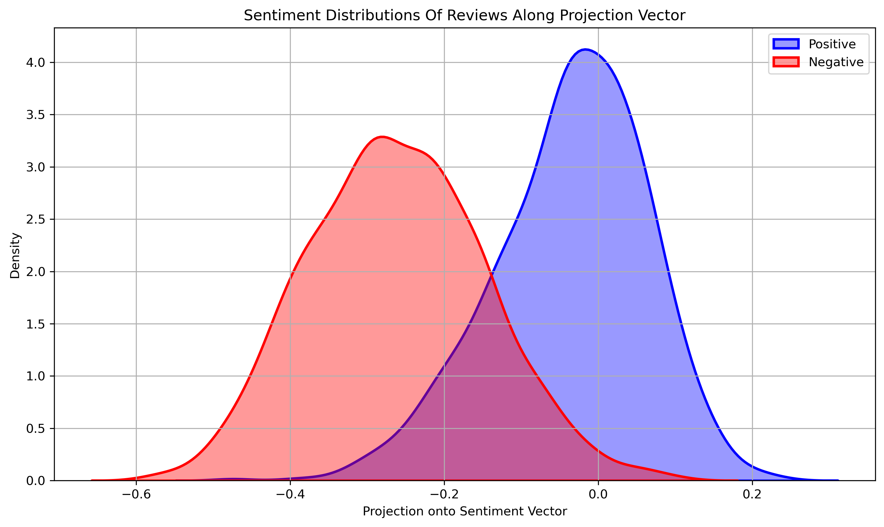

# embedding-projection
WIP, name is temporary

A project developing a potential technique for extracting information from contextual sentence embeddings (sBERT) 

### The projection seems to work decently:

Words corresponding to the 10 smallest embeddings:
['worse', 'terrible', 'sucked', 'horrible', 'worst', 'bad', 'rotten', 'unacceptable', 'stupidity', 'awful']
Words corresponding to the 10 largest embeddings:
['pleasure', 'anytime', 'admired', 'admire', 'fabulous', 'classical', 'beloved', 'romantic', 'anthologies', 'lovely']

### To check if the annotation correlates with human annotators:

It seems there is a rather strong correlation between average human anotator and the projection method!

### Lets see get an idea of what an correlation baseline would even look like.
Annotations of semantics vary when on a continous scale. Different computational methods produce different scores, but different humans also correlate differently with eachother.

